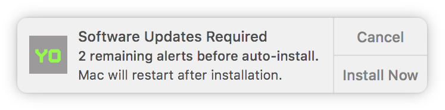
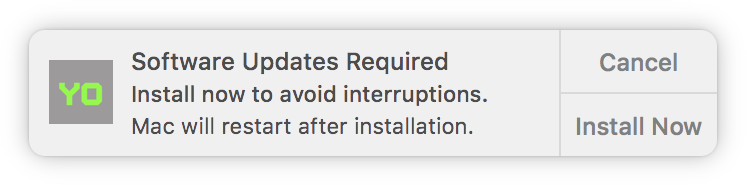
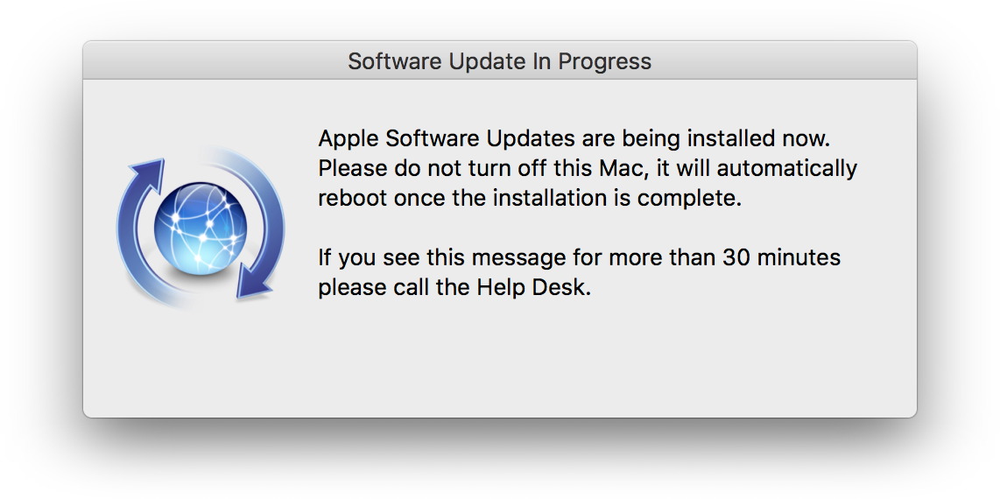

# Nice Updater
A tool to update macOS that (nicely) gives the user several chances to install updates prior to a forced installation and restart (if required).

## Requirements
### Yo
- [Yo](https://github.com/sheagcraig/yo) is required to display the Notification Center alerts. The alerts that 'Yo' create are persistent, and you can specify custom buttons which apply an action. This is used to allow the user to either cancel the alert, or install updates from there easily. *See [Jamf Pro Requirements](https://github.com/ryangball/nice-updater#jamf-pro-requirements) for related information.
- To avoid packaging 'Yo' for use in your Jamf Pro environment, you can configure a Jamf Pro policy with "Execution Frequency" set to "Ongoing", triggered by a custom event called "yo" which runs [install_latest_yo.sh](https://github.com/ryangball/nice-updater/blob/master/install_latest_yo.sh) as a payload.
- Alternatively you can download the latest release .pkg of 'Yo' [here](https://github.com/sheagcraig/yo/releases/latest). There is also info on how to customize the 'Yo' default icon [here](https://github.com/sheagcraig/yo#icons).

### Jamf Pro Requirements
*Note: There are no Jamf Pro policies required in order for this tool to function (if 'Yo' is installed). However, I use Jamf Pro to manage Macs. Consequently, I've created this minimally leveraging Jamf Pro. You could easily adapt this for use in other environments.*
- jamfHelper is used to display the user dialogs when updates are being installed.
- The .pkg preinstall script checks for the presence of 'Yo', if it is not installed it runs a `jamf policy -event yo` to install it (the custom trigger can be changed if necessary). If 'Yo' is not installed and the jamf policy trigger fails, the Nice_Updater.pkg will fail to install.
- The Jamf Binary is used to reboot the Mac (if required).

## Build the Project into a .PKG
To build new versions you can simply run the build.sh script and specify a version number for the .pkg. The resulting .pkg will include the LaunchDaemons and target script as well as necessary preinstall/postinstall scripts. If you do not include a version number as a parameter then version 1.0 will be assigned as the default.
```bash
git clone https://github.com/ryangball/nice-updater.git
cd nice-updater
./build.sh 1.5
```

## Testing
As of release 1.0.3, if you [build](https://github.com/ryangball/nice-updater#build-the-project-into-a-pkg) the .pkg or download the latest [release](https://github.com/ryangball/nice-updater/releases/latest), after installation the main LaunchDaemon will automatically start.

Tail the log to see the current state:
```bash
tail -f /Library/Logs/Nice_Updater.log
```

## Customizing
I've designed this to be very customizable. Most things you'd want to customize would be in [this section of the build.sh script](https://github.com/ryangball/nice-updater/blob/0364aa450901e9d6257d147c4dc0ed1a181765c9/build.sh#L3-L38). After you customize these variables, you can [build](https://github.com/ryangball/nice-updater#build-the-project-into-a-pkg) again and files will auto-magically get updated as necessary.

This methodology also allows you to change the identifier from com.github.ryangball.nice_updater to whatever you want, and all other files will get updated with the new identifier at build time.

Whether you choose to [build](https://github.com/ryangball/nice-updater#build-the-project-into-a-pkg) it yourself, or use the latest [release](https://github.com/ryangball/nice-updater/releases/latest) (after 1.0.3), you can customize nice-updater even after installation of the .pkg by modifying the values of the following keys in the main preference file:

| Key | Type | Description |
| --- | --- | --- |
| UpdateInProgressTitle | string | Title of UpdateInProgressMessage dialog. |
| UpdateInProgressMessage | string | Message to display to the logged in user when restart-required updates are being installed. |
| LoginAfterUpdatesInProgressMessage | string | Message to display to to a user who logged in **while** restart-required updates were being installed. |
| NotificationActionButtonText | string | Button text that is displayed on the 'Yo' notification to **install** pending updates
| NotificationOtherButtonText | string | Button text that is displayed on the 'Yo' notification to **defer** pending updates
| Log | string | Full path of the log file. |
| AfterFullUpdateDelayDayCount | int | After a full update has been performed (all updates available are installed), updates will not be checked again until N days have passed (default is 14 days). |
| AfterEmptyUpdateDelayDayCount | int | Number of days to delay the process after an update check occurs where no updates were found (default is 3). This delay will ensure that we are not checking for updates all day long if there are no updates found in the morning. This is also a good way to stagger updates out over your entire fleet. |
| MaxNotificationCount | int | Max number of alerts for a single user before restart-required updates are force-installed. |
| YoPath | string | Full path of 'Yo'. |
| UpdatesBlocked | bool | Set to true to block updates. |

### Modify Preference File Examples
```bash
#!/bin/bash
# The main identifier of nice-updater (default is shown below, if you've changed this
# you'll need to adjust as necessary)
identifier="com.github.ryangball.nice_updater"

# Change the number of times to alert a single user prior to forcibly installing updates
# to 4 days (default is 3)
defaults write "/Library/Preferences/$identifier.prefs.plist" MaxNotificationCount -int 4

# Block updates during a certain period
defaults write "/Library/Preferences/$identifier.prefs.plist" UpdatesBlocked -bool true

# Unblock updates
defaults delete "/Library/Preferences/$identifier.prefs.plist" UpdatesBlocked

# Change the number of days to delay the process after an update check occurs where
# no updates were found (default is 3)
defaults write "/Library/Preferences/$identifier.prefs.plist" AfterEmptyUpdateDelayDayCount -int 4
```

## Workflow and Options
The nice_updater.sh script is not intended to be executed by simply running the script. It is intended to be executed by passing a parameter into it indicating which function to run. If you do not specify a function, then the script just exits. As an example the primary LaunchDaemon executes the script in this fashion: `/bin/bash /Library/Scripts/nice_updater main`. "Main" indicates the function that is being run.

The primary LaunchDaemon is scheduled to be run every two hours by default (7200 seconds). What happens when it runs is determined by a few things:
### When a User is Not Logged In
- Updates are downloaded, applied immediately, and the Mac is restarted (if required).
- If a restart *is* required and a user logs into the Mac while updates are being applied, the user is notified that updates are being applied and the Mac will be restarted.

### When a User is Logged In
- Updates are downloaded, and if no restart is required the updates are installed immediately in the background.
- If a restart *is* required the user will be alerted via 'Yo'. The user can choose to cancel the alert, or install the restart-required updates now and the Mac will restart afterward.
- The default number of alerts before a forced install of the restart-required updates is 3, this can be changed for your environment. When using this default value a single user gets alerted 3 times (once every two hours) and has the option to install at any of those points, if they do not, two hours after the last alert the update will be applied and the Mac will restart. The user is will also receive a jamfHelper dialog when the updates are being applied letting them know their machine will restart soon.
- The alert logic tracks which users are alerted, so it will only forcibly install those restart-required updates if the same user is alerted 3 times (when using the default value) **or** of course if a user is not logged in.

## Alert Logic
A user is only alerted when updates are pending that require a restart. If a user is being alerted, they will receive a **persistent** Notification Center alert, which they can dismiss. By default a single user can be alerted 3 times before they will receive a jamfHelper message indicating that updates are in progress and the Mac will restart soon. The built-in alert logic tracks which users receive the alerts. In multi-user environments, this is very important because if you simply alert whichever user is logged in at that moment then count those alerts up, you might have a situation where a specific user is only alerted once or not at all before restart-required updates are force-installed.

### Alert Examples
The first alert indicates that updates requiring a restart are pending. The number shown in the alert is dynamic based on the number of times we want to alert the user.
<p align="right">
    
</p>

The second to the last alert lets the user know that they will receive one more alert prior to force-installing updates and restarting.
<p align="right">
    
</p>

In the final alert that the user receives, they will be warned to "Install now to avoid interruptions".
<p align="right">
    
</p>

Once the user has received their final alert and they do not choose to install, the updates will be force-installed and this message will be displayed. This is also the message the user will receive if they select the "Install Now" button from any of the above alerts.
<p align="center">
    
</p>

## What's With Two LaunchDaemons?
When a user is alerted via one of the persistent Notification Center alerts, the user has the option to install updates now. This is done through the 'Yo' action button, which in this case is the "Install Now" button. These actions are performed as the user, meaning that actions which require root permissions could not be performed when a standard user is clicking the "Install Now" button.

To address this issue, when the user is alerted a random key string is generated and stored. This key is then simultaneously written to the main preference file and to the command that gets executed if and when the user clicks the "Install Now" button. Once the user clicks the "Install Now" button, that key is then written to a second preference file and used later in the process. I call this second preference file the "trigger".

The second LaunchDaemon (com.github.ryangball.nice_updater_on_demand) runs the on_demand function of the script. This LaunchDaemon is configured with a "WatchPaths" key, and is set to execute the LaunchDaemon when the trigger file is modified in any way. Because the user has access to modify this trigger file at any time (if they know where to look) a mechanism was put in place to validate that the LaunchDaemon should in fact be running. Since the update key was stored in the main preference file, we can compare it with the key that will be written to the trigger file, and if they match the update process will continue. If the keys don't match, meaning the trigger file was modified by the user without clicking the "Install Now" button, the process will exit without action. This allows us to avoid potentially updating the system when a user inadvertently modifies the trigger file.

## Special Thanks
[kurtroberts](https://github.com/kurtroberts) - For [install_latest_yo.sh](https://github.com/ryangball/nice-updater/blob/master/install_latest_yo.sh)

[grahampugh](https://github.com/grahampugh) - For making me realize I should just start the LaunchDaemon after installation for consistency

[peterlewis](https://github.com/peterlewis) - For adding the ability to customize the Yo action/other buttons via a preference file
